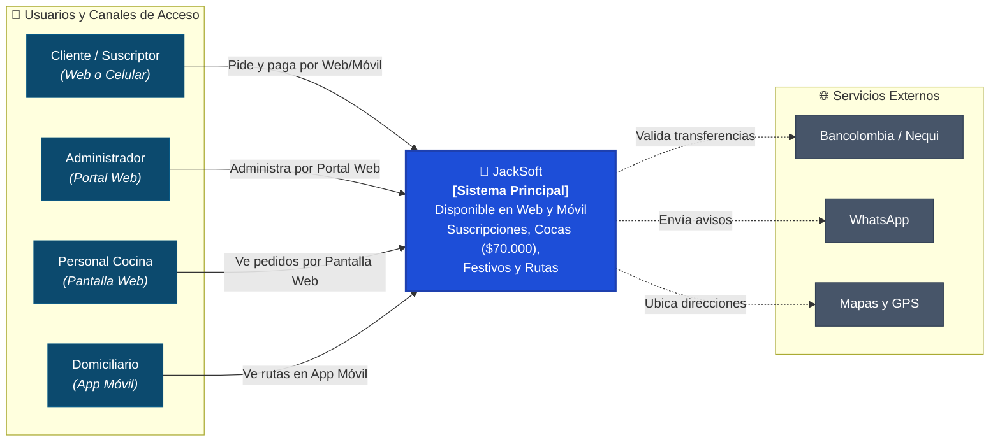
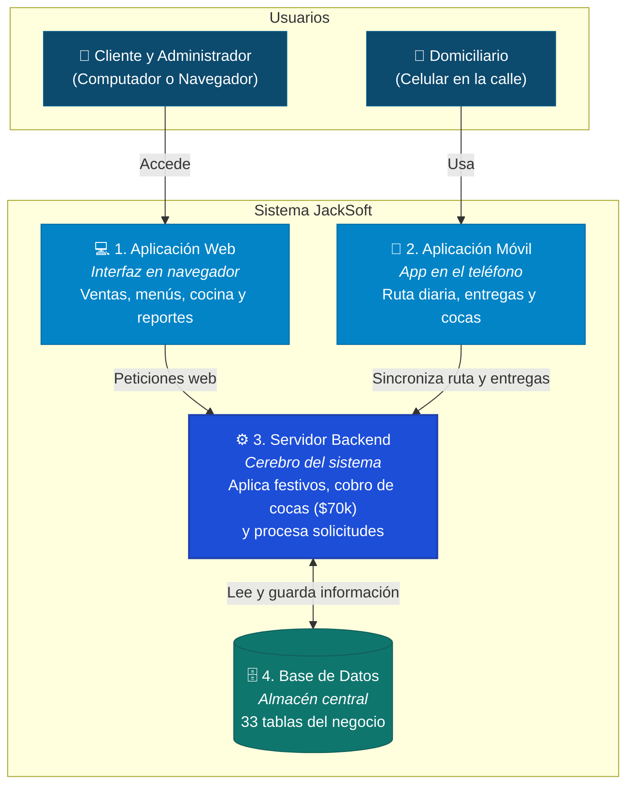
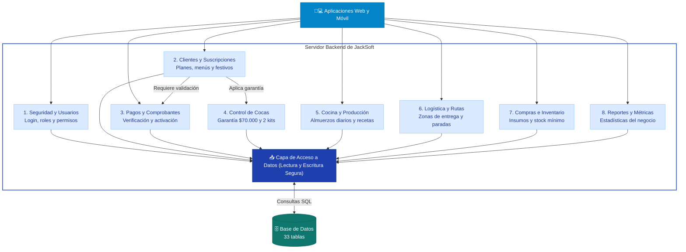
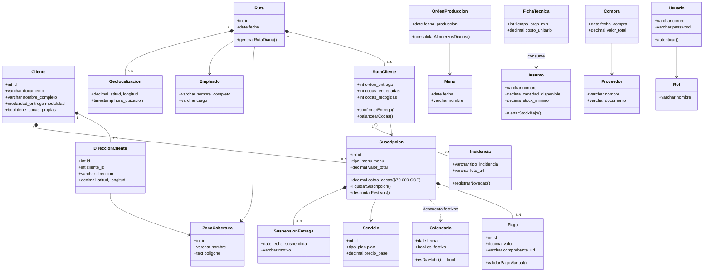

# 🏛️ Arquitectura de Software C4 — JackSoft

El modelo **C4** permite explicar la arquitectura de software de forma progresiva y sencilla. Inicia desde una vista general que cualquier persona puede entender sin conocimientos técnicos (Nivel 1), y a medida que se profundiza, detalla cómo se organizan las aplicaciones, los módulos y las clases del sistema (Niveles 2, 3 y 4).

Toda la información contenida en estos diagramas refleja fielmente la operación real y las reglas de negocio de **La Coca de Jacks S.A.S.**.

---

## 📌 Niveles de la Arquitectura

| Nivel | Nombre | ¿Qué responde? | Archivos Disponibles |
| :---: | :--- | :--- | :--- |
| **Nivel 1** | **Contexto del Sistema** | ¿Quién usa el sistema y con qué plataformas externas se conecta? | [PNG](file:///Users/alejo/Proyectos/MapaMental/05_Casos_de_Uso/Arquitectura_C4/C4_Nivel1_Contexto.png) \| [SVG](file:///Users/alejo/Proyectos/MapaMental/05_Casos_de_Uso/Arquitectura_C4/C4_Nivel1_Contexto.svg) \| [PUML](file:///Users/alejo/Proyectos/MapaMental/05_Casos_de_Uso/Arquitectura_C4/C4_Nivel1_Contexto.puml) |
| **Nivel 2** | **Contenedores** | ¿Cuáles son las aplicaciones (web, móvil) y almacenes de datos? | [PNG](file:///Users/alejo/Proyectos/MapaMental/05_Casos_de_Uso/Arquitectura_C4/C4_Nivel2_Contenedores.png) \| [SVG](file:///Users/alejo/Proyectos/MapaMental/05_Casos_de_Uso/Arquitectura_C4/C4_Nivel2_Contenedores.svg) \| [PUML](file:///Users/alejo/Proyectos/MapaMental/05_Casos_de_Uso/Arquitectura_C4/C4_Nivel2_Contenedores.puml) |
| **Nivel 3** | **Componentes** | ¿Qué módulos internos integran el servidor para gestionar la operación? | [PNG](file:///Users/alejo/Proyectos/MapaMental/05_Casos_de_Uso/Arquitectura_C4/C4_Nivel3_Componentes.png) \| [SVG](file:///Users/alejo/Proyectos/MapaMental/05_Casos_de_Uso/Arquitectura_C4/C4_Nivel3_Componentes.svg) \| [PUML](file:///Users/alejo/Proyectos/MapaMental/05_Casos_de_Uso/Arquitectura_C4/C4_Nivel3_Componentes.puml) |
| **Nivel 4** | **Código y Clases** | ¿Cómo se estructuran las entidades y la lógica del negocio principal? | [PNG](file:///Users/alejo/Proyectos/MapaMental/05_Casos_de_Uso/Arquitectura_C4/C4_Nivel4_Codigo_Clases.png) \| [SVG](file:///Users/alejo/Proyectos/MapaMental/05_Casos_de_Uso/Arquitectura_C4/C4_Nivel4_Codigo_Clases.svg) \| [PUML](file:///Users/alejo/Proyectos/MapaMental/05_Casos_de_Uso/Arquitectura_C4/C4_Nivel4_Codigo_Clases.puml) |

---

## 🌐 Nivel 1: Contexto del Sistema (La Caja Negra)

En el modelo C4 formal, el **Nivel 1 (Contexto)** muestra a **JackSoft como una sola caja cerrada** frente a sus usuarios y plataformas de apoyo. 

Para tener en cuenta que el sistema tiene **Aplicación Web** y **Aplicación Móvil**, este nivel indica el **canal de acceso** que utiliza cada persona para interactuar con JackSoft:
1. **Cliente / Suscriptor:** Solicita planes y paga desde el **Navegador Web o Celular**.
2. **Administrador:** Configura precios, ventas y reportes desde el **Portal Web**.
3. **Personal de Cocina:** Consulta pedidos diarios y menús desde la **Pantalla Web**.
4. **Domiciliario:** Consulta rutas y confirma recogida de cocas desde la **Aplicación Móvil**.
5. **JackSoft (Caja Central):** El sistema integral que unifica toda la lógica de negocio (suscripciones, garantía de $70.000 COP, festivos, recetas y rutas).
6. **Plataformas Externas:** Bancolombia / Nequi (pagos), WhatsApp (notificaciones) y Mapas / GPS (rutas de entrega).

> [!TIP]
> **¿Por qué el Nivel 1 no dibuja la App Web y la App Móvil como cajas separadas?**  
> Porque si en el Nivel 1 dibujamos las cajas de la App Web, la App Móvil, el Servidor y la Base de Datos, **¡el Nivel 1 se vuelve idéntico al Nivel 2!**  
> 
> En C4:
> - **Nivel 1 (Contexto):** Muestra el **canal** por donde entra cada usuario (`[Web]`, `[Móvil]`), pero el sistema es una sola unidad funcional.
> - **Nivel 2 (Contenedores):** Hace **zoom** dentro de JackSoft y destapa la caja para mostrar las **4 piezas ejecutables independientes**: la **App Web** separada de la **App Móvil**, ambas conectándose al **Servidor**, y el Servidor conectándose a la **Base de Datos**.

---

## 📦 Nivel 2: Contenedores del Sistema

Describe las partes de software que componen **JackSoft** y cómo se comunican entre sí de forma sencilla:

1. **Aplicación Web (Navegador):**
   * Usada por el **Cliente** para comprar su plan, y por el **Administrador** y **Cocina** para gestionar el restaurante desde un computador.
2. **Aplicación Móvil (Teléfono del Repartidor):**
   * Usada por el **Domiciliario** en la calle para ver la ruta de entregas, confirmar la entrega del almuerzo y registrar las cocas recogidas.
3. **Servidor Backend (Cerebro del Sistema):**
   * Recibe las órdenes de la web y el móvil.
   * Aplica las reglas del negocio: descuenta los días festivos (para no cobrarlos), cobra el depósito de garantía de las cocas ($70.000 COP) y organiza los pedidos.
4. **Base de Datos Relacional:**
   * Almacén ordenado y seguro que guarda las **33 tablas** de clientes, pedidos, recetas, pagos e insumos.

---

## 🧩 Nivel 3: Componentes del Servidor Backend

Muestra cómo está organizado internamente el **Servidor Backend**, distribuido exactamente en los **módulos reales de JackSoft**:

1. **Módulo de Seguridad y Usuarios:** Control de acceso, inicio de sesión seguro, roles y permisos de cada empleado.
2. **Módulo de Clientes y Suscripciones:** Gestión de clientes, planes (semanal, quincenal, mensual), menús (estándar o personalizado) y descuento de festivos.
3. **Módulo de Pagos y Comprobantes:** Verificación del comprobante bancario (Nequi o Bancolombia) y activación de la suscripción.
4. **Módulo de Control de Cocas:** Custodia del depósito de garantía ($70.000 COP), control del balance de 2 kits por cliente y registro de recipientes dañados.
5. **Módulo de Cocina y Producción:** Conteo de almuerzos diarios a cocinar, recetas, ingredientes y restricciones médicas.
6. **Módulo de Logística y Rutas:** Organización de las direcciones de entrega por zonas en Medellín y paradas de los repartidores.
7. **Módulo de Compras e Inventario:** Control de compras a proveedores, entradas y salidas de alimentos y alertas de stock mínimo.
8. **Módulo de Reportes y Métricas:** Resumen de ventas, entregas efectivas y métricas para la gerencia.
9. **Capa de Acceso a Datos:** Conexión encargada de leer y escribir en la Base de Datos.

---

## 💻 Nivel 4: Código y Clases del Negocio (33 Clases del Modelo DBML)

El **Nivel 4** representa las clases del modelo de dominio de **JackSoft**, derivadas de manera exacta y completa (1 a 1) a partir de las **33 tablas** definidas en `jacksoft_modelo_relacional (V2).dbml`. Las 33 clases se agrupan en sus **7 módulos oficiales**:

### 1. Configuración y RBAC (3 Clases)
* **`Rol`:** Roles del sistema (Administrador, Cocina, Domiciliario, Cliente).
* **`Permiso`:** Acciones autorizadas por módulo funcional.
* **`RolPermiso`:** Tabla intermedia que asocia permisos específicos a cada rol.

### 2. Usuarios y Auditoría (2 Clases)
* **`Usuario`:** Cuentas administrativas y operativas con contraseña cifrada (bcrypt), correo y documento.
* **`Acceso`:** Bitácora de auditoría de inicio de sesión (IP, navegador, fecha, hora y resultado de autenticación).

### 3. Compras e Insumos (6 Clases)
* **`CategoriaInsumo`:** Clasificación de materia prima (Lácteos, Verduras, Proteínas, Abarrotes).
* **`Insumo`:** Existencias en almacén, unidad de medida, precio de referencia y alertas de stock mínimo.
* **`Proveedor`:** Proveedores de alimentos con documento de identidad/NIT y contacto.
* **`InsumoProveedor`:** Precios y tiempos de entrega pactados por proveedor (marca quién es el principal y quién el respaldo).
* **`Compra`:** Facturas y órdenes de compra con estado de aprobación y monto total.
* **`CompraDetalle`:** Líneas individuales de insumos adquiridos con cantidad y precio pactado.

### 4. Producción, Cocina y Recetas (9 Clases)
* **`Empleado`:** Personal vinculado de la empresa con cargo asignado.
* **`CategoriaPreparacion`:** Clasificación de platos (Sopas, Carnes, Acompañamientos, Ensaladas).
* **`Preparacion`:** Platos o guarniciones cocinadas individualmente.
* **`Menu`:** Menú diario planificado para una jornada específica.
* **`MenuPreparacion`:** Intermedia que compone el menú del día a partir de las preparaciones disponibles.
* **`FichaTecnica`:** Receta estándar con porciones, tiempos y costo estimado.
* **`FichaTecnicaDetalle`:** Desglose de insumos y cantidades exactas requeridas por preparación.
* **`OrdenProduccion`:** Orden de cocina del día para preparar los almuerzos según clientes activos.
* **`OrdenProduccionDetalle`:** Seguimiento en tiempo real de porciones cocinadas vs. planeadas.

### 5. Servicios y Agenda (3 Clases)
* **`CategoriaServicio`:** Clasificación de servicios comerciales.
* **`Servicio`:** Tarifas base y duración de los planes de alimentación (Semanal, Quincenal, Mensual).
* **`Calendario`:** Días festivos y feriados oficiales para el cálculo y descuento de suscripciones.

### 6. Clientes y Suscripciones (5 Clases)
* **`ZonaCobertura`:** Polígonos GeoJSON de cobertura de entrega en el Valle de Aburrá / Medellín.
* **`Cliente`:** Datos del suscriptor, modalidad (fija o híbrida), si posee cocas propias y clave de app.
* **`DireccionCliente`:** Direcciones de entrega validadas geográficamente (hasta 5 en modalidad híbrida).
* **`Suscripcion`:** Entidad núcleo: plan, tipo de menú, liquidación, descuento de festivos y cobro de cocas (**$70.000 COP**).
* **`Pago`:** Registro de comprobante bancario (Nequi / Bancolombia) y validación manual del administrador.

### 7. Logística y Distribución (5 Clases)
* **`Ruta`:** Jornada de reparto diaria asignada a un domiciliario en una zona de cobertura.
* **`RutaCliente`:** Parada de entrega con control numérico del balance de **cocas entregadas y recogidas**.
* **`Geolocalizacion`:** Trazas de coordenadas GPS transmitidas por la app móvil del domiciliario.
* **`Incidencia`:** Auditoría de novedades operacionales (recipientes dañados, ausencias, averías).
* **`SuspensionEntrega`:** Solicitud de ausencia voluntaria del cliente (no amplía la vigencia ni devuelve dinero).

---

## 🖼️ Archivos Listos para el Manual Técnico

En la carpeta [`05_Casos_de_Uso/Arquitectura_C4/`](file:///Users/alejo/Proyectos/MapaMental/05_Casos_de_Uso/Arquitectura_C4) cuentas con los archivos listos:

* 🖼️ **Nivel 1 (Contexto):** [`C4_Nivel1_Contexto.png`](file:///Users/alejo/Proyectos/MapaMental/05_Casos_de_Uso/Arquitectura_C4/C4_Nivel1_Contexto.png) \| [SVG](file:///Users/alejo/Proyectos/MapaMental/05_Casos_de_Uso/Arquitectura_C4/C4_Nivel1_Contexto.svg)
* 🖼️ **Nivel 2 (Contenedores):** [`C4_Nivel2_Contenedores.png`](file:///Users/alejo/Proyectos/MapaMental/05_Casos_de_Uso/Arquitectura_C4/C4_Nivel2_Contenedores.png) \| [SVG](file:///Users/alejo/Proyectos/MapaMental/05_Casos_de_Uso/Arquitectura_C4/C4_Nivel2_Contenedores.svg)
* 🖼️ **Nivel 3 (Componentes):** [`C4_Nivel3_Componentes.png`](file:///Users/alejo/Proyectos/MapaMental/05_Casos_de_Uso/Arquitectura_C4/C4_Nivel3_Componentes.png) \| [SVG](file:///Users/alejo/Proyectos/MapaMental/05_Casos_de_Uso/Arquitectura_C4/C4_Nivel3_Componentes.svg)
* 🖼️ **Nivel 4 (Código y Clases):** [`C4_Nivel4_Codigo_Clases.png`](file:///Users/alejo/Proyectos/MapaMental/05_Casos_de_Uso/Arquitectura_C4/C4_Nivel4_Codigo_Clases.png) \| [SVG](file:///Users/alejo/Proyectos/MapaMental/05_Casos_de_Uso/Arquitectura_C4/C4_Nivel4_Codigo_Clases.svg)
