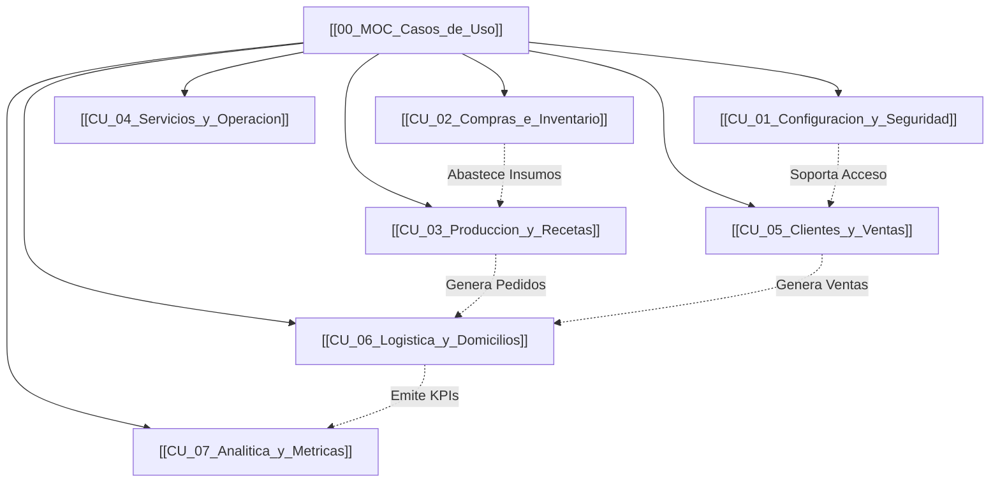

# 🎯 00 MOC — Casos de Uso y Módulos del Sistema (CU)

Este Mapa de Contenido consolida la especificación funcional detallada de los 7 macro-procesos del sistema **JackSoft**, desglosados en subprocesos, diagramas PlantUML/Mermaid y listados de casos de uso por rol.

---

## 🗺️ Mapa de Módulos del Sistema

---

## 📚 Catálogo de Módulos Funcionales

1. **[[CU_01_Configuracion_y_Seguridad]]**: Administración de Roles (7 CUs), Permisos (6 CUs), Usuarios (6 CUs) y Mecanismos de Autenticación/Acceso (6 CUs).
2. **[[CU_02_Compras_e_Inventario]]**: Categorías de Insumos (5 CUs), Gestión de Insumos (7 CUs), Categorías de Productos (5 CUs), Productos (6 CUs), Proveedores (6 CUs) y Compras (6 CUs).
3. **[[CU_03_Produccion_y_Recetas]]**: Empleados de Cocina (6 CUs), Fichas Técnicas (6 CUs), Órdenes de Producción (6 CUs) y Producto Terminado (5 CUs).
4. **[[CU_04_Servicios_y_Operacion]]**: Planes de Servicio (6 CUs), Categorías de Servicio (5 CUs) y Agenda de Festivos (4 CUs).
5. **[[CU_05_Clientes_y_Ventas]]**: Registro de Clientes (6 CUs), Suscripciones / Ventas (8 CUs), Renovaciones (4 CUs) y Validación de Comprobantes (5 CUs).
6. **[[CU_06_Logistica_y_Domicilios]]**: Zonas de Cobertura (5 CUs), Asignación de Rutas (6 CUs), Tracking GPS en Tiempo Real (4 CUs), Gestión de Incidencias (6 CUs) y App Domiciliarios (6 CUs).
7. **[[CU_07_Analitica_y_Metricas]]**: Panel Dashboard (5 CUs), Reportes de Ventas (4 CUs), Reportes de Producción (4 CUs) y Reportes Logísticos (4 CUs).

---

## 🎨 Recursos y Diagramas del Módulo

- **Diagramas Editables:** `05_Casos_de_Uso/Diagramas_DrawIO/Casos_de_usos.drawio` (22 diagramas editables actualizados).
- **Código y Exportaciones:**
  - `05_Casos_de_Uso/Diagramas_PUML/` (23 archivos en PlantUML).
  - `05_Casos_de_Uso/Diagramas_SVG/` (23 archivos vectoriales).
  - `05_Casos_de_Uso/Diagramas_PNG/` (24 diagramas de alta resolución).
- **Documento Oficial de Fichas:** `05_Casos_de_Uso/Especificaciones/Documentacion_Casos_de_Uso_JackSoft.docx` (243 fichas funcionales).
- **Subprocesos v3:** `05_Casos_de_Uso/casos_de_uso_v3/` (desglose minucioso por cada subproceso).
- **Arquitectura C4 (Niveles 1 al 4):** `05_Casos_de_Uso/Arquitectura_C4/Arquitectura_C4_JackSoft.md` (Contexto, Contenedores, Componentes, Clases).
- **Visor Interactivo Web:** `05_Casos_de_Uso/Visor_Interactivo/mapa_interactivo.html` y `mapa_interactivo.svg`.
- **Integración con el Manual Técnico:** La versión vigente consolidada de estos casos de uso se encuentra documentada en `Manual_Tecnico_v2.1_Jacksoft.docx` y auditada en [[Correcciones_Manual_Tecnico_v1]] dentro de [[00_MOC_Manual_Tecnico]].
