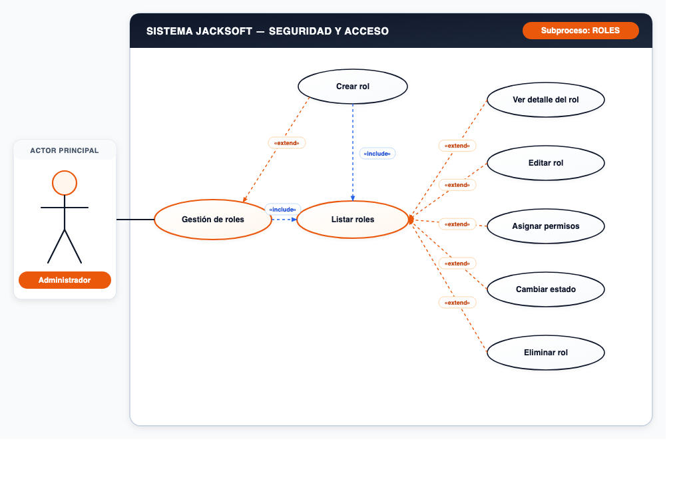
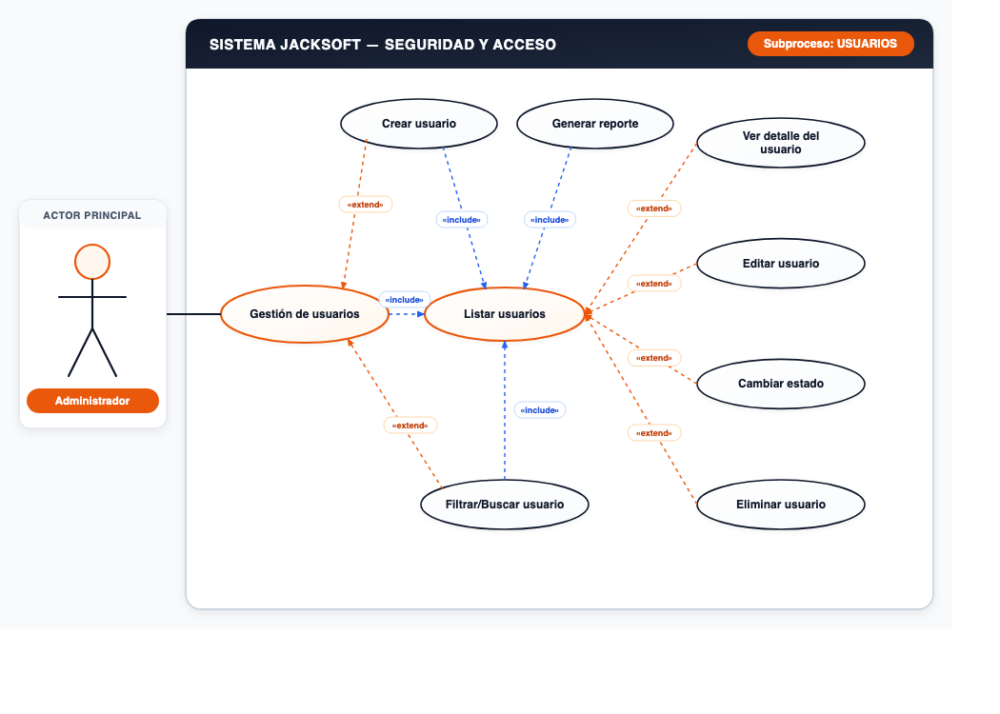
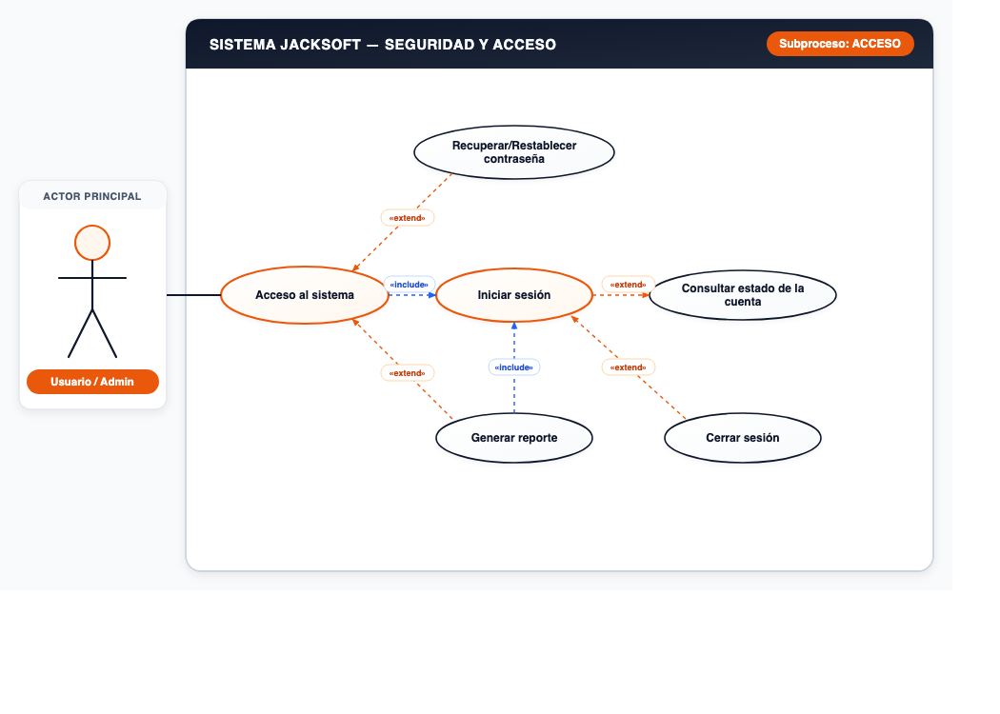

# 📌 CU-01: Módulo de Configuración y Seguridad

## 📌 Descripción General
Gestión de roles, permisos, usuarios y mecanismos de autenticación y acceso al sistema.

---

## 📋 Subprocesos y Especificación Funcional

### Subproceso 1: ROLES (7 Casos de Uso)
* **Actor Principal:** `Administrador`
* **Nodo Principal:** `Gestión de roles`

#### Casos de Uso Oficiales:
1. **Crear rol**
2. **Listar roles**
3. **Ver detalle del rol**
4. **Editar rol**
5. **Asignar permisos**
6. **Cambiar estado**
7. **Eliminar rol**

---

### Subproceso 2: USUARIOS (8 Casos de Uso)
* **Actor Principal:** `Administrador`
* **Nodo Principal:** `Gestión de usuarios`

#### Casos de Uso Oficiales:
1. **Crear usuario**
2. **Listar usuarios**
3. **Generar reporte**
4. **Ver detalle del usuario**
5. **Editar usuario**
6. **Cambiar estado**
7. **Eliminar usuario**
8. **Filtrar/Buscar usuario**

---

### Subproceso 3: ACCESO (5 Casos de Uso)
* **Actor Principal:** `Usuario / Admin`
* **Nodo Principal:** `Acceso al sistema`

#### Casos de Uso Oficiales:
1. **Iniciar sesión**
2. **Recuperar/Restablecer contraseña**
3. **Consultar estado de la cuenta**
4. **Cerrar sesión**
5. **Generar reporte**

---
