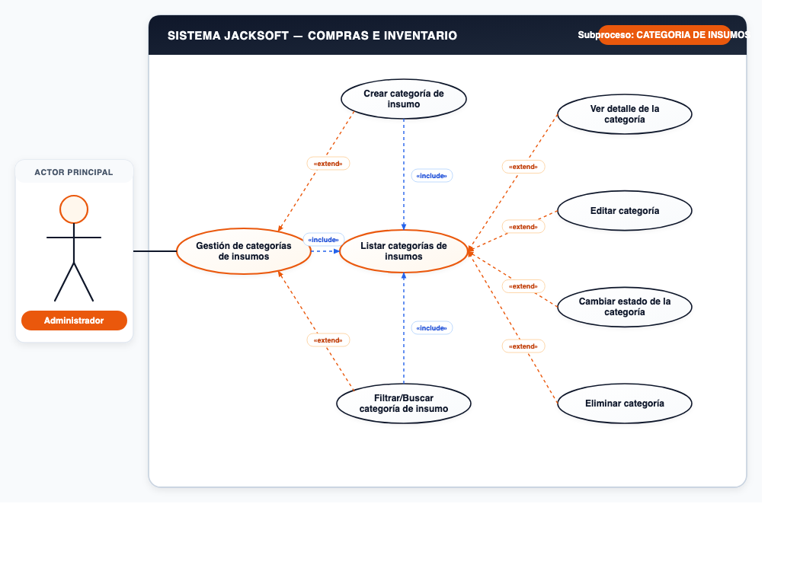
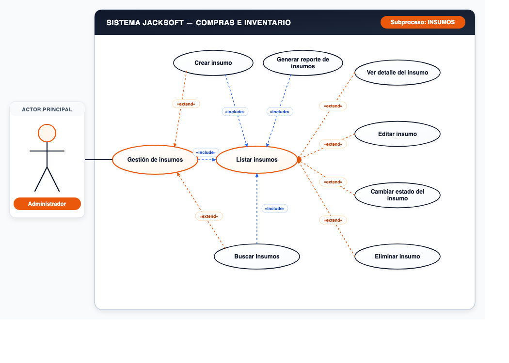
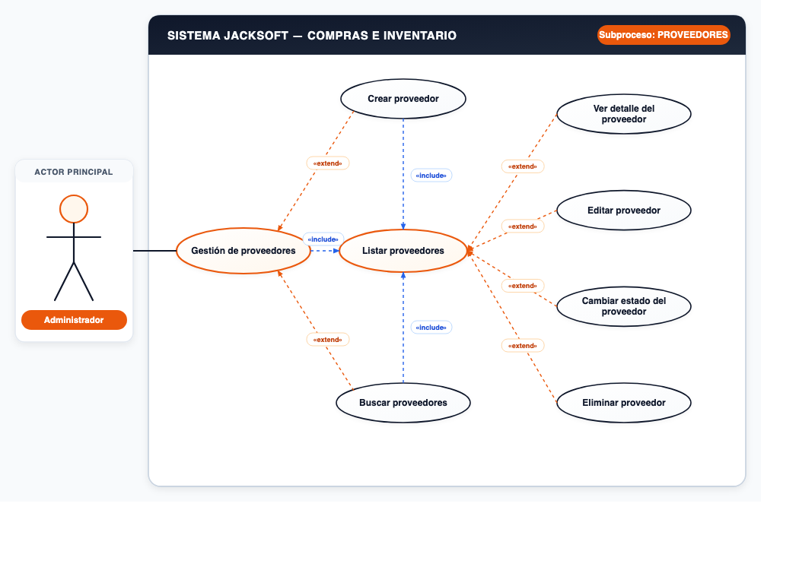
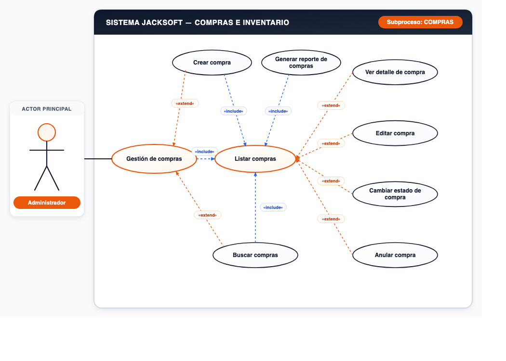

# 📌 CU-02: Módulo de Compras e Inventario

## 📌 Descripción General
Gestión del catálogo de insumos, categorías de materia prima, proveedores y órdenes de compra.

---

## 📋 Subprocesos y Especificación Funcional

### Subproceso 1: CATEGORIA DE INSUMOS (7 Casos de Uso)
* **Actor Principal:** `Administrador`
* **Nodo Principal:** `Gestión de categorías de insumos`

#### Casos de Uso Oficiales:
1. **Crear categoría de insumo**
2. **Listar categorías de insumos**
3. **Ver detalle de la categoría**
4. **Editar categoría**
5. **Cambiar estado de la categoría**
6. **Eliminar categoría**
7. **Filtrar/Buscar categoría de insumo**

---

### Subproceso 2: INSUMOS (8 Casos de Uso)
* **Actor Principal:** `Administrador`
* **Nodo Principal:** `Gestión de insumos`

#### Casos de Uso Oficiales:
1. **Crear insumo**
2. **Listar insumos**
3. **Ver detalle del insumo**
4. **Editar insumo**
5. **Cambiar estado del insumo**
6. **Generar reporte de insumos**
7. **Buscar Insumos**
8. **Eliminar insumo**

---

### Subproceso 3: PROVEEDORES (7 Casos de Uso)
* **Actor Principal:** `Administrador`
* **Nodo Principal:** `Gestión de proveedores`

#### Casos de Uso Oficiales:
1. **Crear proveedor**
2. **Listar proveedores**
3. **Ver detalle del proveedor**
4. **Editar proveedor**
5. **Cambiar estado del proveedor**
6. **Buscar proveedores**
7. **Eliminar proveedor**

---

### Subproceso 4: COMPRAS (8 Casos de Uso)
* **Actor Principal:** `Administrador`
* **Nodo Principal:** `Gestión de compras`

#### Casos de Uso Oficiales:
1. **Crear compra**
2. **Listar compras**
3. **Ver detalle de compra**
4. **Editar compra**
5. **Cambiar estado de compra**
6. **Anular compra**
7. **Generar reporte de compras**
8. **Buscar compras**

---
