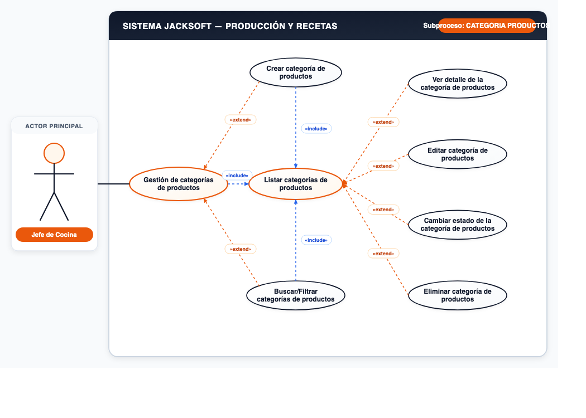
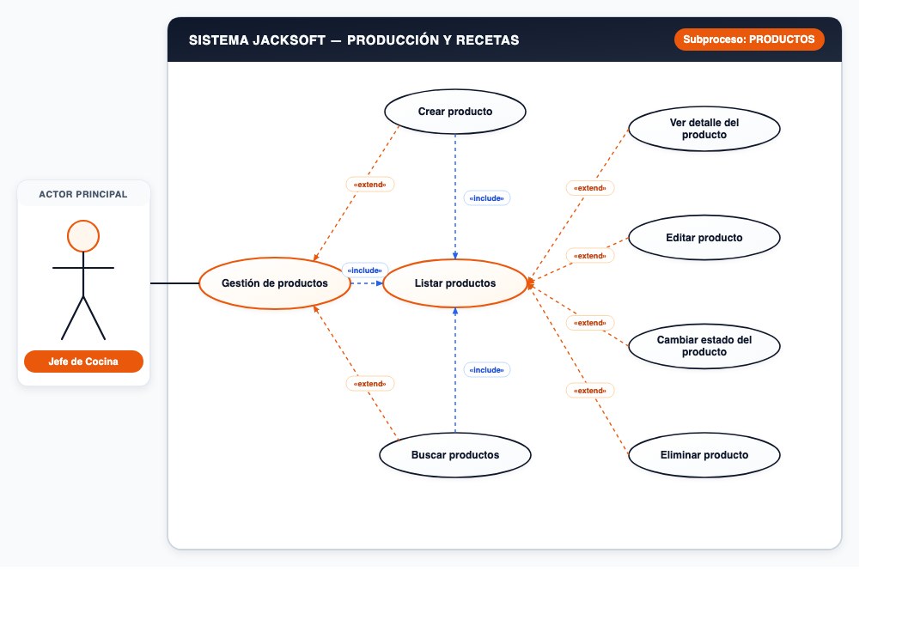
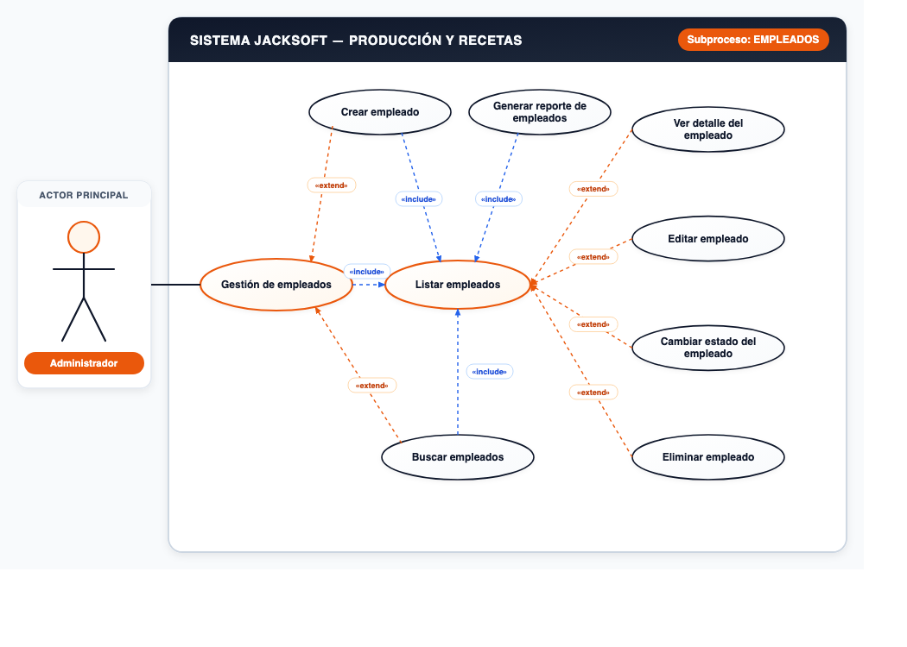
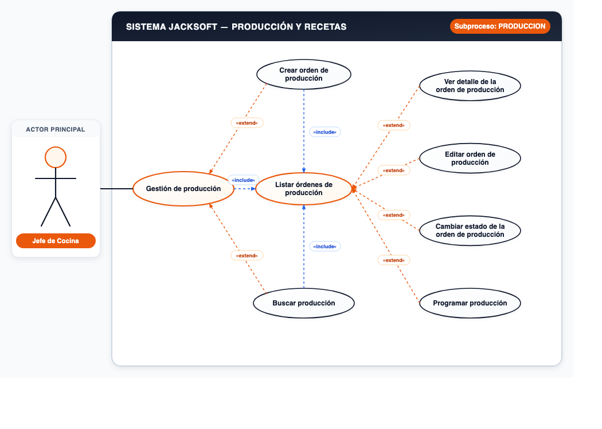
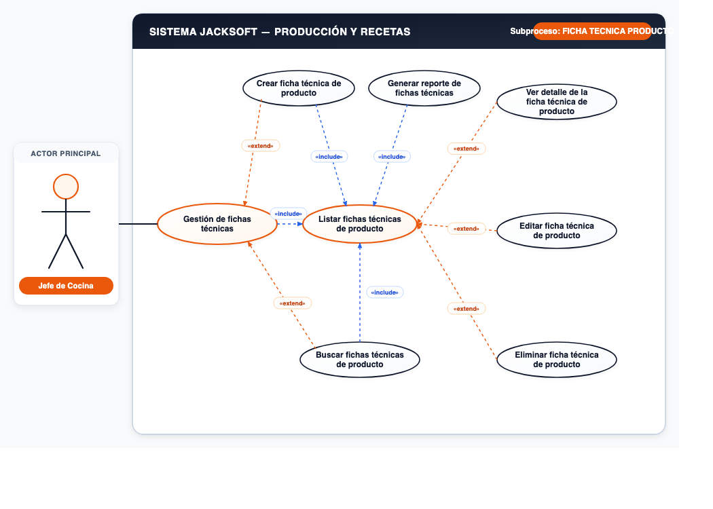
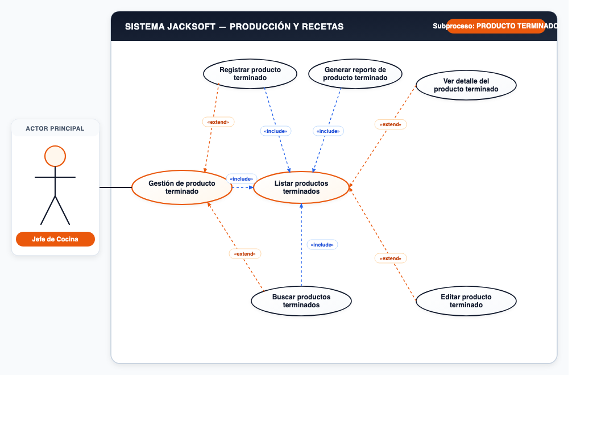

# 📌 CU-03: Módulo de Producción y Recetas

## 📌 Descripción General
Control de personal de cocina, categorías y catálogo de productos, fichas técnicas (recetas), órdenes de producción y producto terminado.

---

## 📋 Subprocesos y Especificación Funcional

### Subproceso 1: CATEGORIA PRODUCTOS (7 Casos de Uso)
* **Actor Principal:** `Jefe de Cocina`
* **Nodo Principal:** `Gestión de categorías de productos`

#### Casos de Uso Oficiales:
1. **Crear categoría de productos**
2. **Listar categorías de productos**
3. **Ver detalle de la categoría de productos**
4. **Editar categoría de productos**
5. **Cambiar estado de la categoría de productos**
6. **Eliminar categoría de productos**
7. **Buscar/Filtrar categorías de productos**

---

### Subproceso 2: PRODUCTOS (7 Casos de Uso)
* **Actor Principal:** `Jefe de Cocina`
* **Nodo Principal:** `Gestión de productos`

#### Casos de Uso Oficiales:
1. **Crear producto**
2. **Listar productos**
3. **Ver detalle del producto**
4. **Editar producto**
5. **Cambiar estado del producto**
6. **Buscar productos**
7. **Eliminar producto**

---

### Subproceso 3: EMPLEADOS (8 Casos de Uso)
* **Actor Principal:** `Administrador`
* **Nodo Principal:** `Gestión de empleados`

#### Casos de Uso Oficiales:
1. **Crear empleado**
2. **Listar empleados**
3. **Generar reporte de empleados**
4. **Ver detalle del empleado**
5. **Editar empleado**
6. **Cambiar estado del empleado**
7. **Eliminar empleado**
8. **Buscar empleados**

---

### Subproceso 4: PRODUCCION (7 Casos de Uso)
* **Actor Principal:** `Jefe de Cocina`
* **Nodo Principal:** `Gestión de producción`

#### Casos de Uso Oficiales:
1. **Crear orden de producción**
2. **Listar órdenes de producción**
3. **Ver detalle de la orden de producción**
4. **Editar orden de producción**
5. **Cambiar estado de la orden de producción**
6. **Programar producción**
7. **Buscar producción**

---

### Subproceso 5: FICHA TECNICA "PRODUCTO" (7 Casos de Uso)
* **Actor Principal:** `Jefe de Cocina`
* **Nodo Principal:** `Gestión de fichas técnicas`

#### Casos de Uso Oficiales:
1. **Crear ficha técnica de producto**
2. **Listar fichas técnicas de producto**
3. **Ver detalle de la ficha técnica de producto**
4. **Editar ficha técnica de producto**
5. **Buscar fichas técnicas de producto**
6. **Generar reporte de fichas técnicas**
7. **Eliminar ficha técnica de producto**

---

### Subproceso 6: PRODUCTO TERMINADO (6 Casos de Uso)
* **Actor Principal:** `Jefe de Cocina`
* **Nodo Principal:** `Gestión de producto terminado`

#### Casos de Uso Oficiales:
1. **Registrar producto terminado**
2. **Listar productos terminados**
3. **Ver detalle del producto terminado**
4. **Editar producto terminado**
5. **Buscar productos terminados**
6. **Generar reporte de producto terminado**

---
