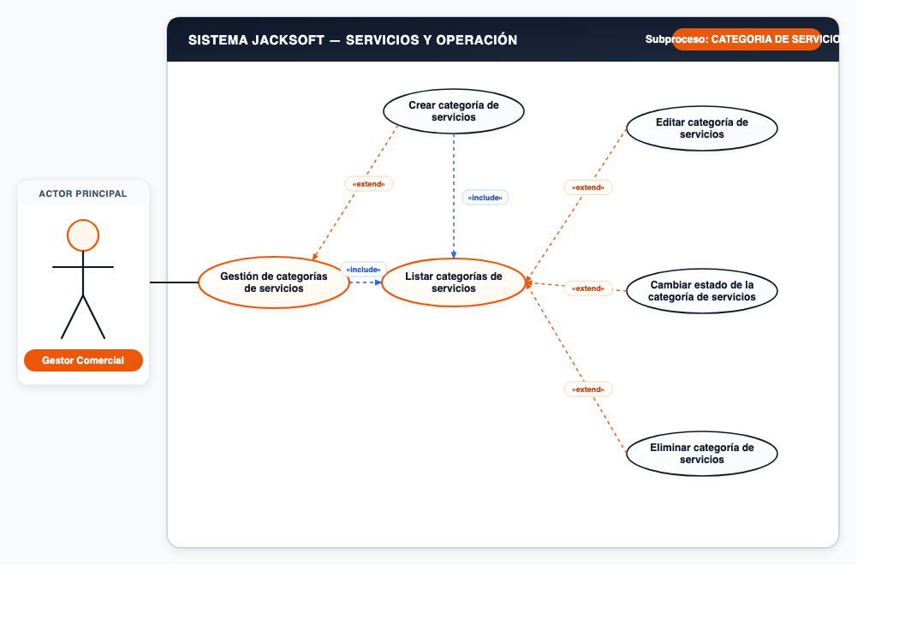
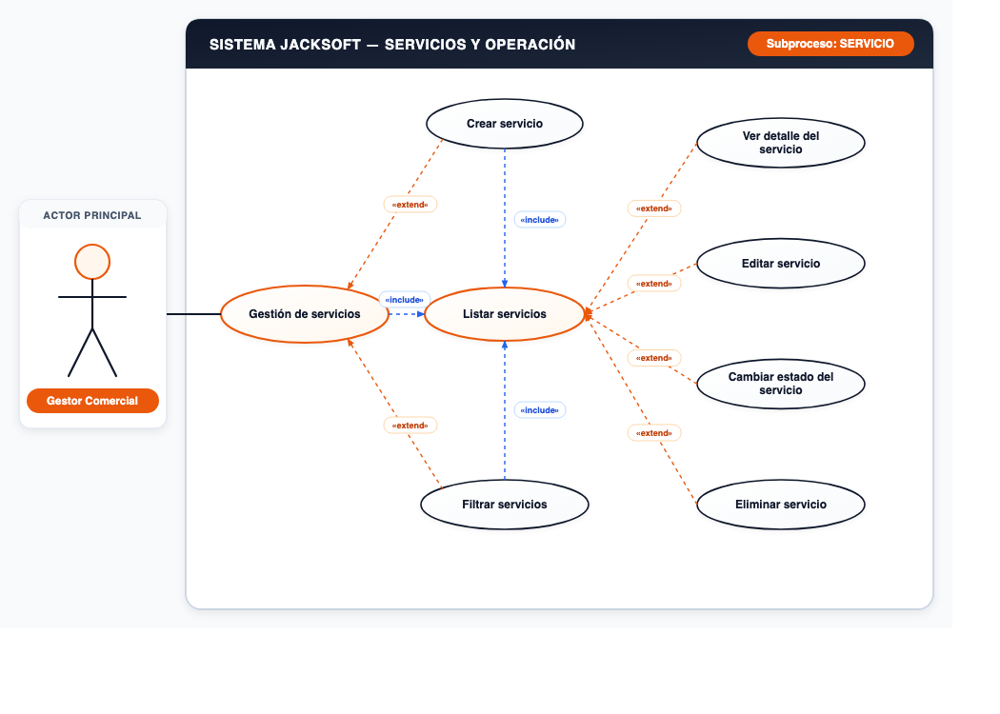
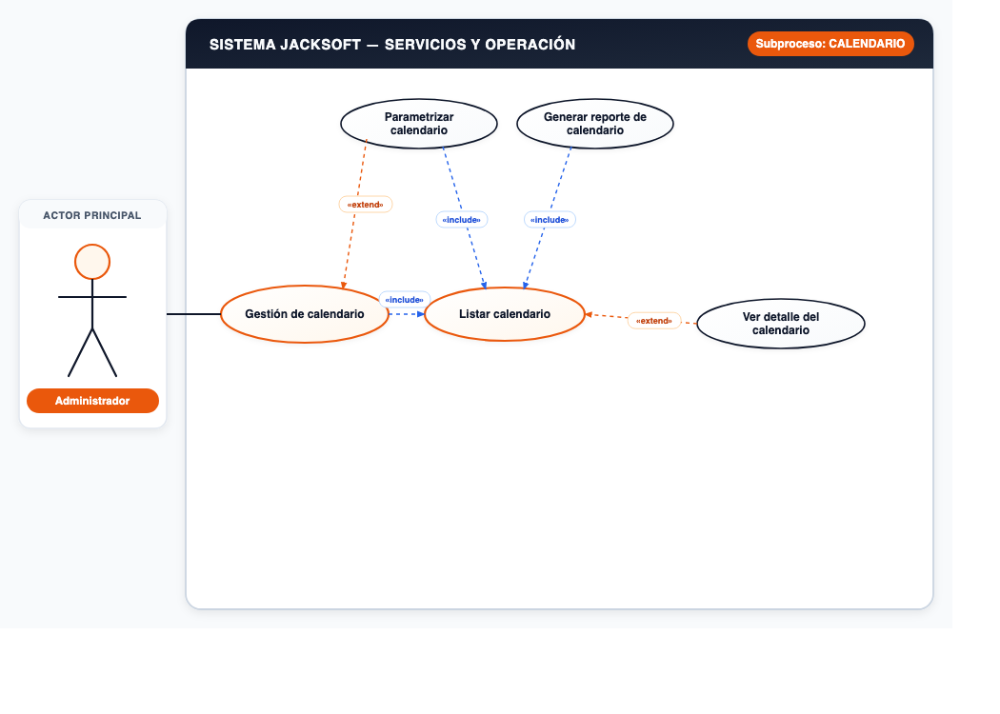

# 📌 CU-04: Módulo de Servicios y Operación

## 📌 Descripción General
Administración de categorías y tipos de servicios (almuerzos, catering), y parametrización del calendario operativo.

---

## 📋 Subprocesos y Especificación Funcional

### Subproceso 1: CATEGORIA DE SERVICIOS (5 Casos de Uso)
* **Actor Principal:** `Gestor Comercial`
* **Nodo Principal:** `Gestión de categorías de servicios`

#### Casos de Uso Oficiales:
1. **Crear categoría de servicios**
2. **Listar categorías de servicios**
3. **Editar categoría de servicios**
4. **Cambiar estado de la categoría de servicios**
5. **Eliminar categoría de servicios**

---

### Subproceso 2: SERVICIO (7 Casos de Uso)
* **Actor Principal:** `Gestor Comercial`
* **Nodo Principal:** `Gestión de servicios`

#### Casos de Uso Oficiales:
1. **Crear servicio**
2. **Listar servicios**
3. **Ver detalle del servicio**
4. **Editar servicio**
5. **Cambiar estado del servicio**
6. **Filtrar servicios**
7. **Eliminar servicio**

---

### Subproceso 3: CALENDARIO (4 Casos de Uso)
* **Actor Principal:** `Administrador`
* **Nodo Principal:** `Gestión de calendario`

#### Casos de Uso Oficiales:
1. **Parametrizar calendario**
2. **Listar calendario**
3. **Ver detalle del calendario**
4. **Generar reporte de calendario**

---
