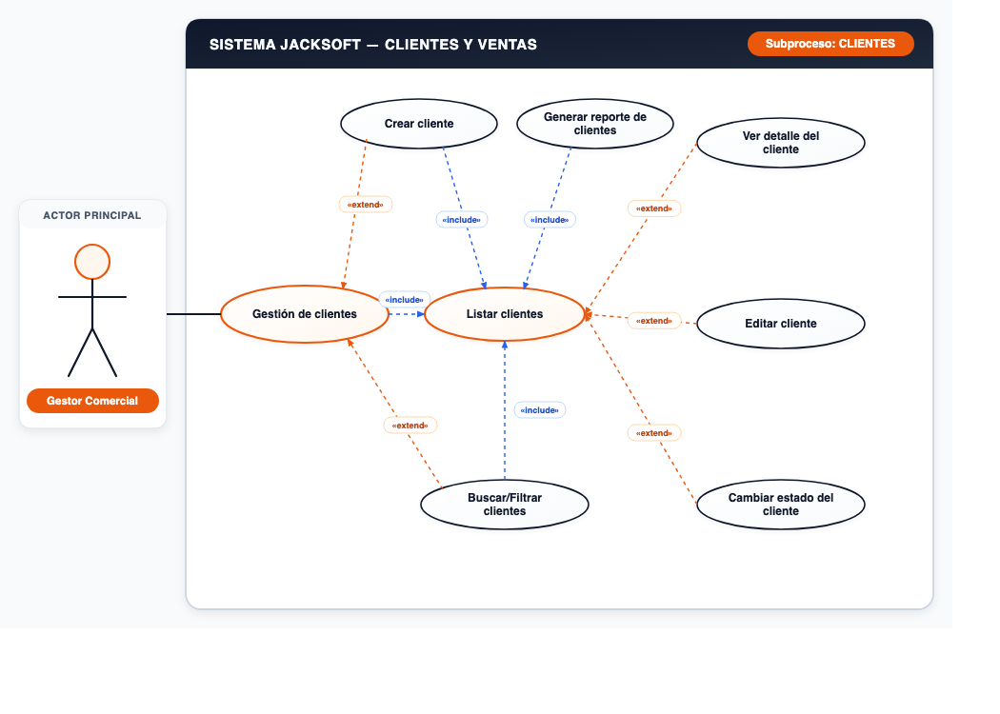
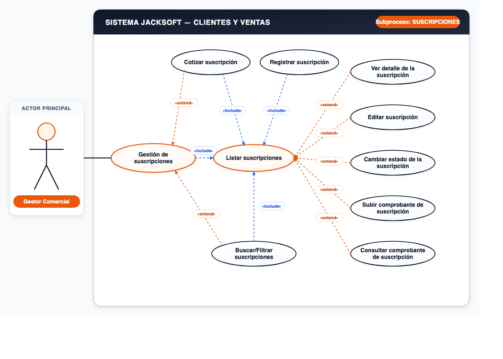

# 📌 CU-05: Módulo de Clientes y Ventas

## 📌 Descripción General
Gestión de clientes, cotización, registro y administración de suscripciones corporativas e individuales.

---

## 📋 Subprocesos y Especificación Funcional

### Subproceso 1: CLIENTES (7 Casos de Uso)
* **Actor Principal:** `Gestor Comercial`
* **Nodo Principal:** `Gestión de clientes`

#### Casos de Uso Oficiales:
1. **Crear cliente**
2. **Listar clientes**
3. **Generar reporte de clientes**
4. **Ver detalle del cliente**
5. **Editar cliente**
6. **Cambiar estado del cliente**
7. **Buscar/Filtrar clientes**

---

### Subproceso 2: SUSCRIPCIONES (9 Casos de Uso)
* **Actor Principal:** `Gestor Comercial`
* **Nodo Principal:** `Gestión de suscripciones`

#### Casos de Uso Oficiales:
1. **Cotizar suscripción**
2. **Registrar suscripción**
3. **Listar suscripciones**
4. **Ver detalle de la suscripción**
5. **Editar suscripción**
6. **Cambiar estado de la suscripción**
7. **Subir comprobante de suscripción**
8. **Consultar comprobante de suscripción**
9. **Buscar/Filtrar suscripciones**

---
