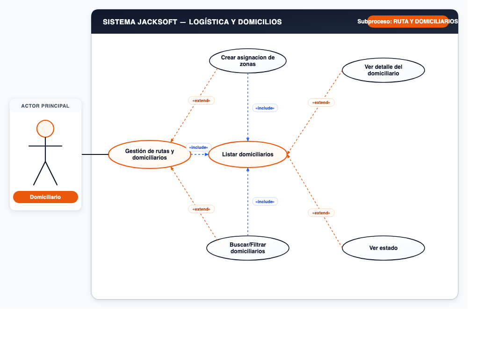
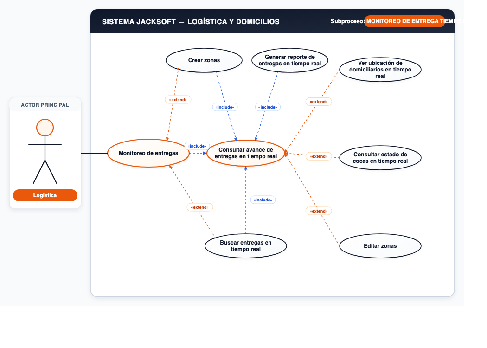
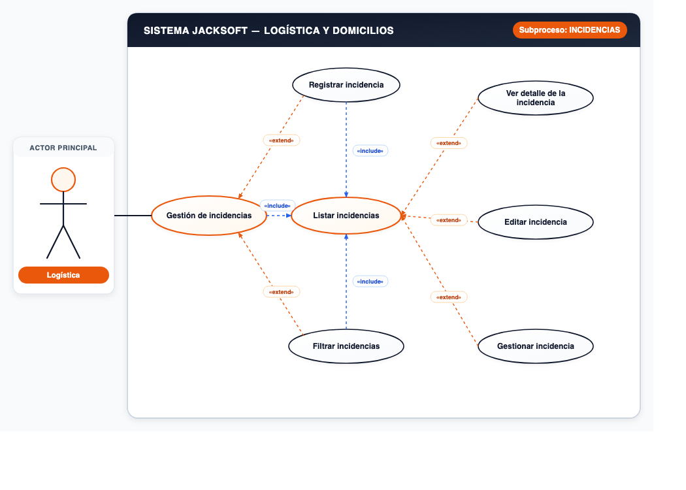

# 📌 CU-06: Módulo de Logística y Domicilios

## 📌 Descripción General
Asignación de zonas de reparto, gestión de domiciliarios, monitoreo en tiempo real de entregas y gestión de incidencias operativas.

---

## 📋 Subprocesos y Especificación Funcional

### Subproceso 1: RUTA Y DOMICILIARIOS (5 Casos de Uso)
* **Actor Principal:** `Domiciliario`
* **Nodo Principal:** `Gestión de rutas y domiciliarios`

#### Casos de Uso Oficiales:
1. **Crear asignacion de zonas**
2. **Listar domiciliarios**
3. **Ver detalle del domiciliario**
4. **Ver estado**
5. **Buscar/Filtrar domiciliarios**

---

### Subproceso 2: MONITOREO DE ENTREGA "TIEMPO REAL" (7 Casos de Uso)
* **Actor Principal:** `Logística`
* **Nodo Principal:** `Monitoreo de entregas`

#### Casos de Uso Oficiales:
1. **Ver ubicación de domiciliarios en tiempo real**
2. **Consultar avance de entregas en tiempo real**
3. **Consultar estado de cocas en tiempo real**
4. **Buscar entregas en tiempo real**
5. **Generar reporte de entregas en tiempo real**
6. **Crear zonas**
7. **Editar zonas**

---

### Subproceso 3: INCIDENCIAS (6 Casos de Uso)
* **Actor Principal:** `Logística`
* **Nodo Principal:** `Gestión de incidencias`

#### Casos de Uso Oficiales:
1. **Registrar incidencia**
2. **Listar incidencias**
3. **Ver detalle de la incidencia**
4. **Editar incidencia**
5. **Gestionar incidencia**
6. **Filtrar incidencias**

---
