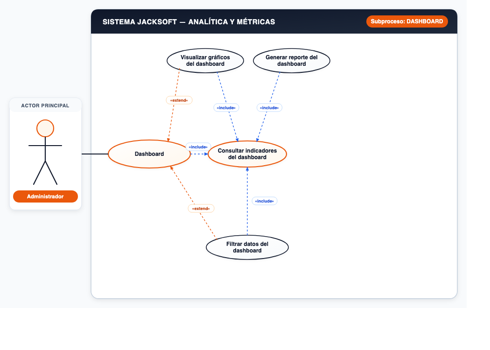

# 📌 CU-07: Módulo de Analítica y Métricas

## 📌 Descripción General
Consulta de indicadores clave de rendimiento (KPIs), visualización gráfica de métricas y generación de reportes de gestión.

---

## 📋 Subprocesos y Especificación Funcional

### Subproceso 1: DASHBOARD (4 Casos de Uso)
* **Actor Principal:** `Administrador`
* **Nodo Principal:** `Dashboard`

#### Casos de Uso Oficiales:
1. **Consultar indicadores del dashboard**
2. **Visualizar gráficos del dashboard**
3. **Filtrar datos del dashboard**
4. **Generar reporte del dashboard**

---
