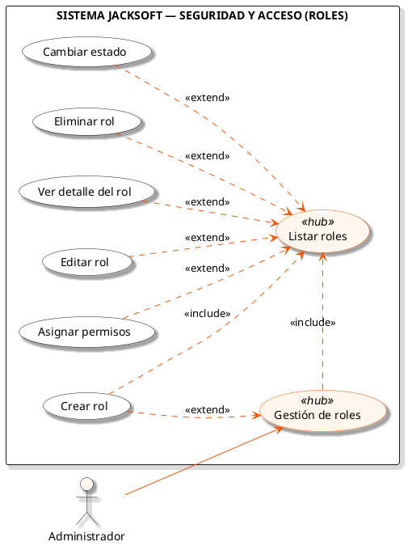
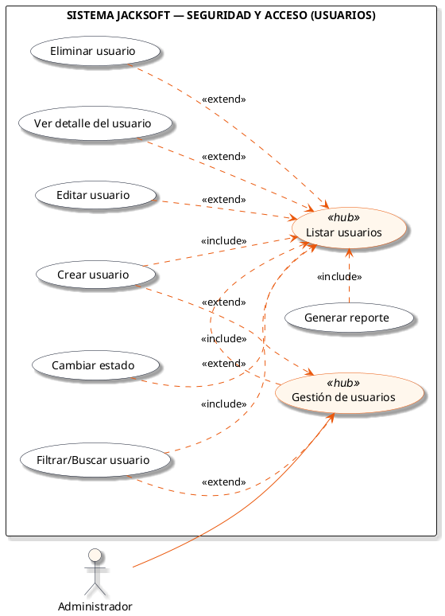
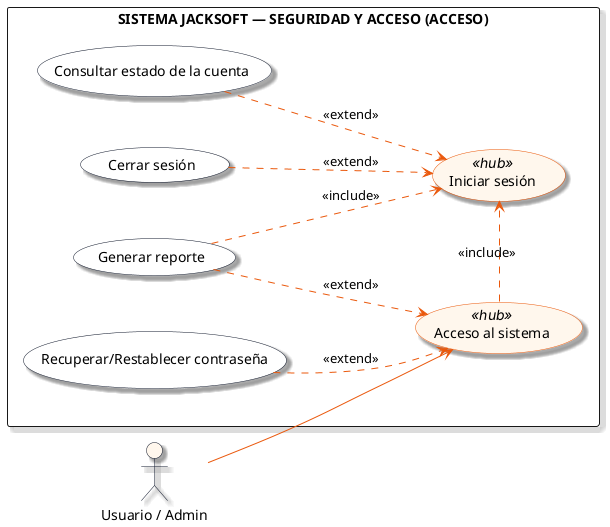

# Macro-Proceso: Configuración y Seguridad

Gestión de roles, permisos, usuarios y mecanismos de autenticación y acceso al sistema.

## Subprocesos Integrados

### Subproceso: ROLES
- **Total de Casos de Uso / Acciones:** 7
- **Actor Principal:** Administrador
- **Nodo Principal:** Gestión de roles

#### Listado de Casos de Uso
1. Crear rol
2. Listar roles
3. Ver detalle del rol
4. Editar rol
5. Asignar permisos
6. Cambiar estado
7. Eliminar rol

#### Diagrama PlantUML

---

### Subproceso: USUARIOS
- **Total de Casos de Uso / Acciones:** 8
- **Actor Principal:** Administrador
- **Nodo Principal:** Gestión de usuarios

#### Listado de Casos de Uso
1. Crear usuario
2. Listar usuarios
3. Generar reporte
4. Ver detalle del usuario
5. Editar usuario
6. Cambiar estado
7. Eliminar usuario
8. Filtrar/Buscar usuario

#### Diagrama PlantUML

---

### Subproceso: ACCESO
- **Total de Casos de Uso / Acciones:** 5
- **Actor Principal:** Usuario / Admin
- **Nodo Principal:** Acceso al sistema

#### Listado de Casos de Uso
1. Iniciar sesión
2. Recuperar/Restablecer contraseña
3. Consultar estado de la cuenta
4. Cerrar sesión
5. Generar reporte

#### Diagrama PlantUML

---
