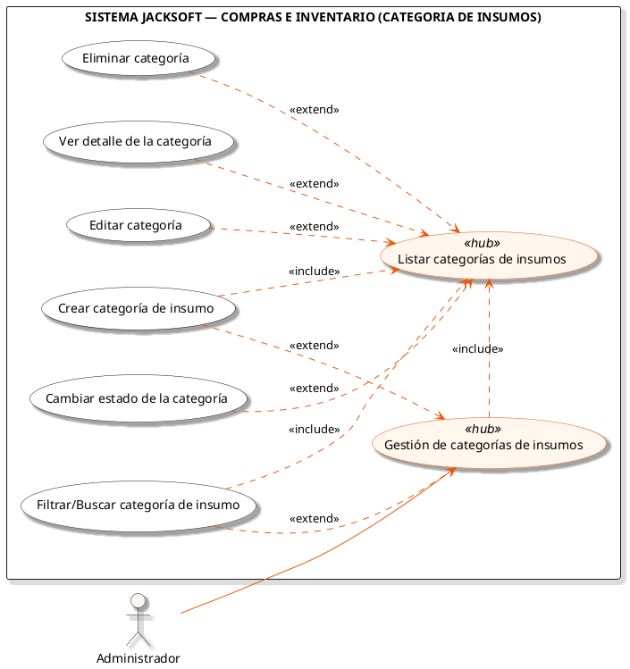
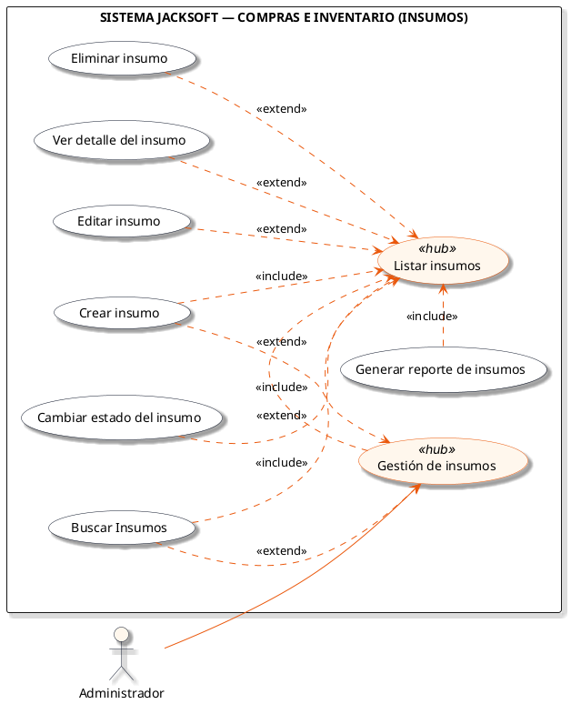
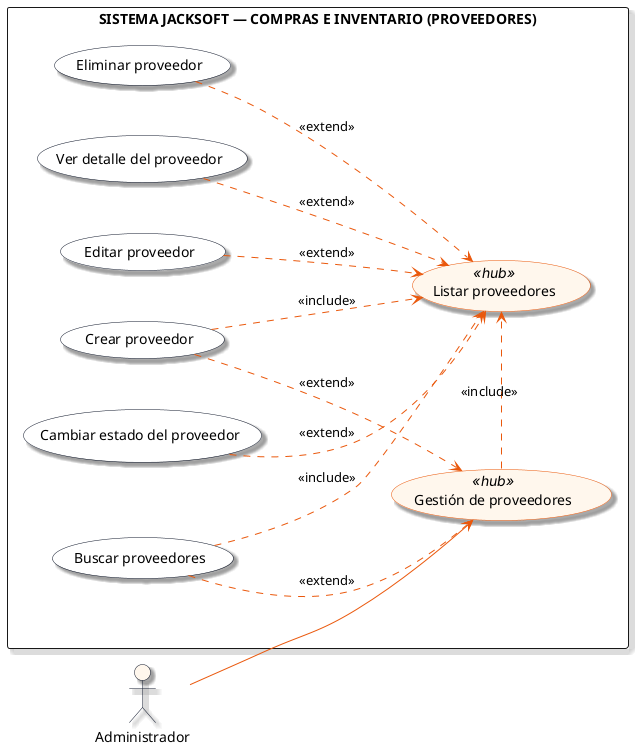

# Macro-Proceso: Compras e Inventario

Gestión del catálogo de insumos, categorías de materia prima, proveedores y órdenes de compra.

## Subprocesos Integrados

### Subproceso: CATEGORIA DE INSUMOS
- **Total de Casos de Uso / Acciones:** 7
- **Actor Principal:** Administrador
- **Nodo Principal:** Gestión de categorías de insumos

#### Listado de Casos de Uso
1. Crear categoría de insumo
2. Listar categorías de insumos
3. Ver detalle de la categoría
4. Editar categoría
5. Cambiar estado de la categoría
6. Eliminar categoría
7. Filtrar/Buscar categoría de insumo

#### Diagrama PlantUML

---

### Subproceso: INSUMOS
- **Total de Casos de Uso / Acciones:** 8
- **Actor Principal:** Administrador
- **Nodo Principal:** Gestión de insumos

#### Listado de Casos de Uso
1. Crear insumo
2. Listar insumos
3. Ver detalle del insumo
4. Editar insumo
5. Cambiar estado del insumo
6. Generar reporte de insumos
7. Buscar Insumos
8. Eliminar insumo

#### Diagrama PlantUML

---

### Subproceso: PROVEEDORES
- **Total de Casos de Uso / Acciones:** 7
- **Actor Principal:** Administrador
- **Nodo Principal:** Gestión de proveedores

#### Listado de Casos de Uso
1. Crear proveedor
2. Listar proveedores
3. Ver detalle del proveedor
4. Editar proveedor
5. Cambiar estado del proveedor
6. Buscar proveedores
7. Eliminar proveedor

#### Diagrama PlantUML

---

### Subproceso: COMPRAS
- **Total de Casos de Uso / Acciones:** 8
- **Actor Principal:** Administrador
- **Nodo Principal:** Gestión de compras

#### Listado de Casos de Uso
1. Crear compra
2. Listar compras
3. Ver detalle de compra
4. Editar compra
5. Cambiar estado de compra
6. Anular compra
7. Generar reporte de compras
8. Buscar compras

#### Diagrama PlantUML

---
