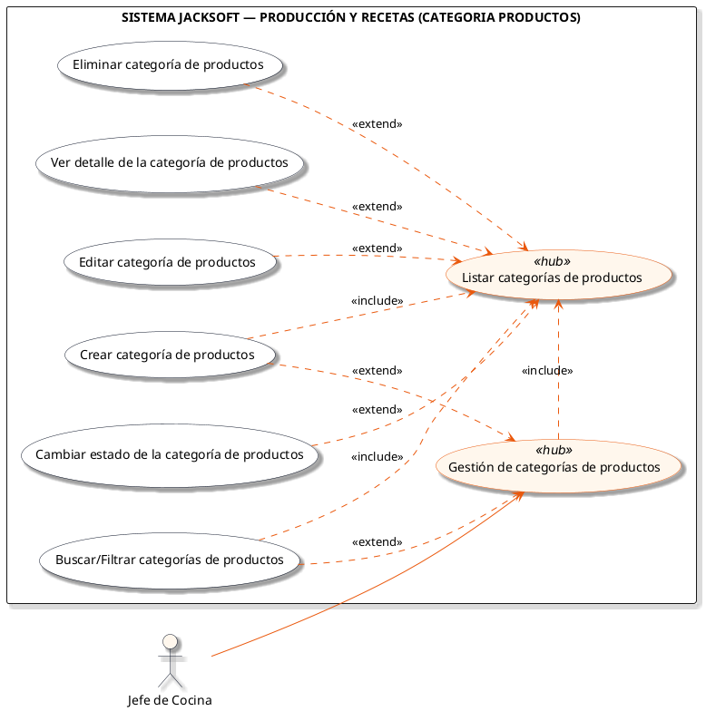
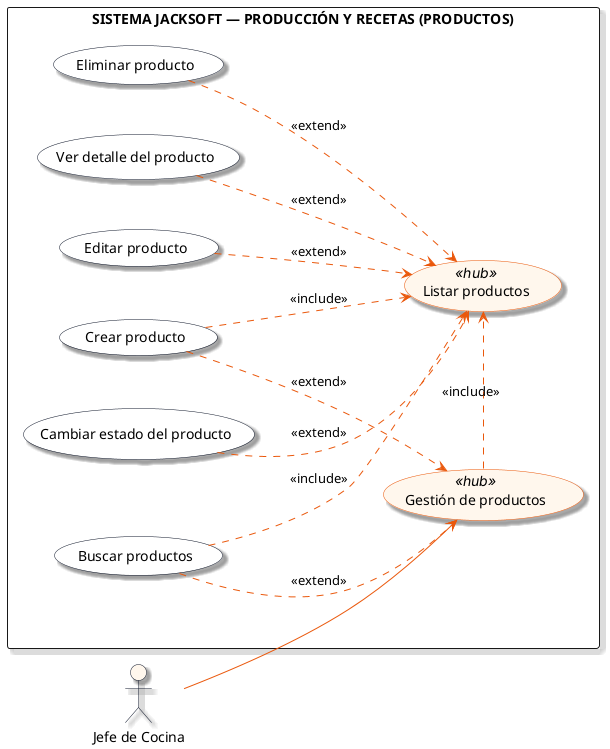
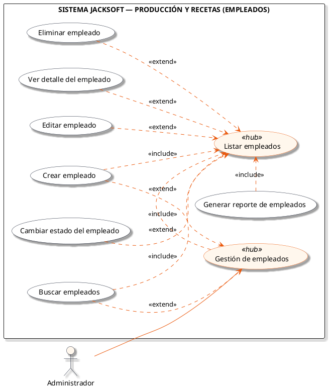
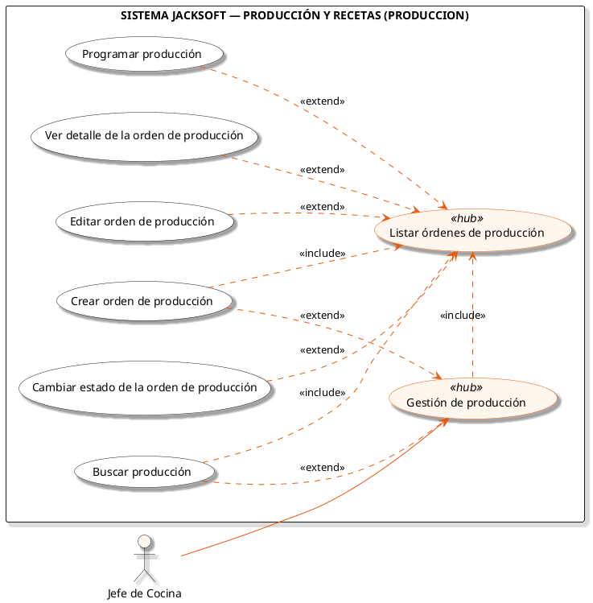
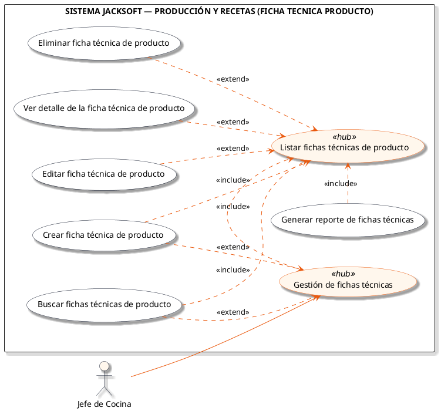
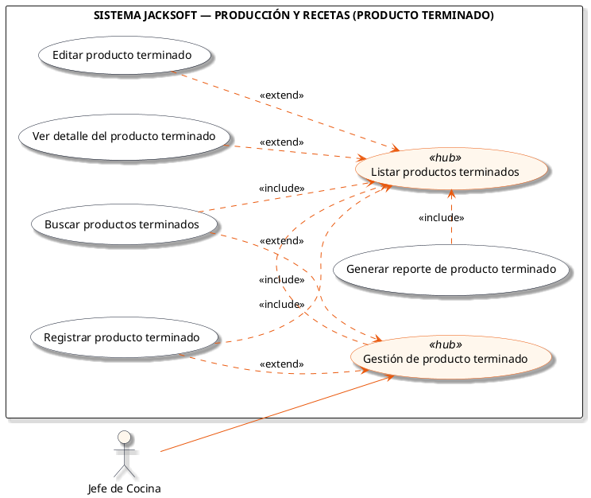

# Macro-Proceso: Producción y Recetas

Control de personal de cocina, categorías y catálogo de productos, fichas técnicas (recetas), órdenes de producción y producto terminado.

## Subprocesos Integrados

### Subproceso: CATEGORIA PRODUCTOS
- **Total de Casos de Uso / Acciones:** 7
- **Actor Principal:** Jefe de Cocina
- **Nodo Principal:** Gestión de categorías de productos

#### Listado de Casos de Uso
1. Crear categoría de productos
2. Listar categorías de productos
3. Ver detalle de la categoría de productos
4. Editar categoría de productos
5. Cambiar estado de la categoría de productos
6. Eliminar categoría de productos
7. Buscar/Filtrar categorías de productos

#### Diagrama PlantUML

---

### Subproceso: PRODUCTOS
- **Total de Casos de Uso / Acciones:** 7
- **Actor Principal:** Jefe de Cocina
- **Nodo Principal:** Gestión de productos

#### Listado de Casos de Uso
1. Crear producto
2. Listar productos
3. Ver detalle del producto
4. Editar producto
5. Cambiar estado del producto
6. Buscar productos
7. Eliminar producto

#### Diagrama PlantUML

---

### Subproceso: EMPLEADOS
- **Total de Casos de Uso / Acciones:** 8
- **Actor Principal:** Administrador
- **Nodo Principal:** Gestión de empleados

#### Listado de Casos de Uso
1. Crear empleado
2. Listar empleados
3. Generar reporte de empleados
4. Ver detalle del empleado
5. Editar empleado
6. Cambiar estado del empleado
7. Eliminar empleado
8. Buscar empleados

#### Diagrama PlantUML

---

### Subproceso: PRODUCCION
- **Total de Casos de Uso / Acciones:** 7
- **Actor Principal:** Jefe de Cocina
- **Nodo Principal:** Gestión de producción

#### Listado de Casos de Uso
1. Crear orden de producción
2. Listar órdenes de producción
3. Ver detalle de la orden de producción
4. Editar orden de producción
5. Cambiar estado de la orden de producción
6. Programar producción
7. Buscar producción

#### Diagrama PlantUML

---

### Subproceso: FICHA TECNICA "PRODUCTO"
- **Total de Casos de Uso / Acciones:** 7
- **Actor Principal:** Jefe de Cocina
- **Nodo Principal:** Gestión de fichas técnicas

#### Listado de Casos de Uso
1. Crear ficha técnica de producto
2. Listar fichas técnicas de producto
3. Ver detalle de la ficha técnica de producto
4. Editar ficha técnica de producto
5. Buscar fichas técnicas de producto
6. Generar reporte de fichas técnicas
7. Eliminar ficha técnica de producto

#### Diagrama PlantUML

---

### Subproceso: PRODUCTO TERMINADO
- **Total de Casos de Uso / Acciones:** 6
- **Actor Principal:** Jefe de Cocina
- **Nodo Principal:** Gestión de producto terminado

#### Listado de Casos de Uso
1. Registrar producto terminado
2. Listar productos terminados
3. Ver detalle del producto terminado
4. Editar producto terminado
5. Buscar productos terminados
6. Generar reporte de producto terminado

#### Diagrama PlantUML

---
