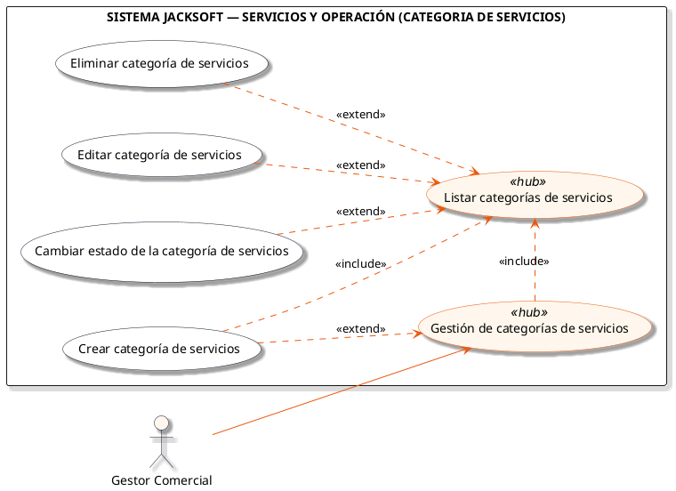
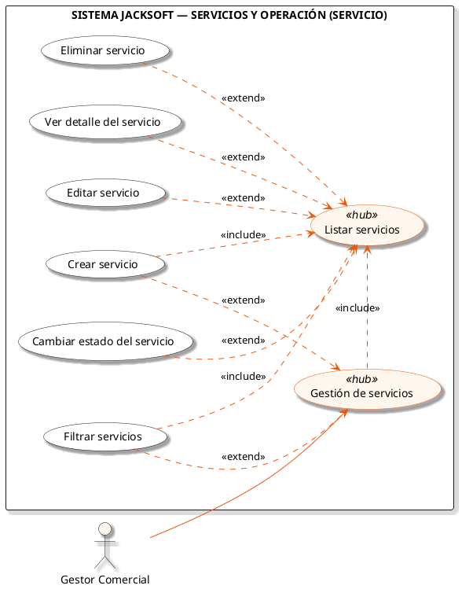
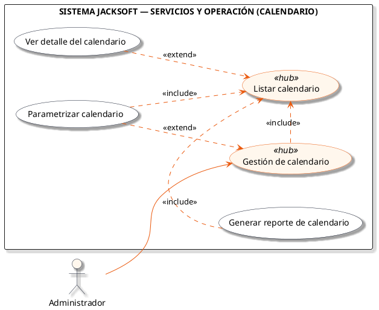

# Macro-Proceso: Servicios y Operación

Administración de categorías y tipos de servicios (almuerzos, catering), y parametrización del calendario operativo.

## Subprocesos Integrados

### Subproceso: CATEGORIA DE SERVICIOS
- **Total de Casos de Uso / Acciones:** 5
- **Actor Principal:** Gestor Comercial
- **Nodo Principal:** Gestión de categorías de servicios

#### Listado de Casos de Uso
1. Crear categoría de servicios
2. Listar categorías de servicios
3. Editar categoría de servicios
4. Cambiar estado de la categoría de servicios
5. Eliminar categoría de servicios

#### Diagrama PlantUML

---

### Subproceso: SERVICIO
- **Total de Casos de Uso / Acciones:** 7
- **Actor Principal:** Gestor Comercial
- **Nodo Principal:** Gestión de servicios

#### Listado de Casos de Uso
1. Crear servicio
2. Listar servicios
3. Ver detalle del servicio
4. Editar servicio
5. Cambiar estado del servicio
6. Filtrar servicios
7. Eliminar servicio

#### Diagrama PlantUML

---

### Subproceso: CALENDARIO
- **Total de Casos de Uso / Acciones:** 4
- **Actor Principal:** Administrador
- **Nodo Principal:** Gestión de calendario

#### Listado de Casos de Uso
1. Parametrizar calendario
2. Listar calendario
3. Ver detalle del calendario
4. Generar reporte de calendario

#### Diagrama PlantUML

---
