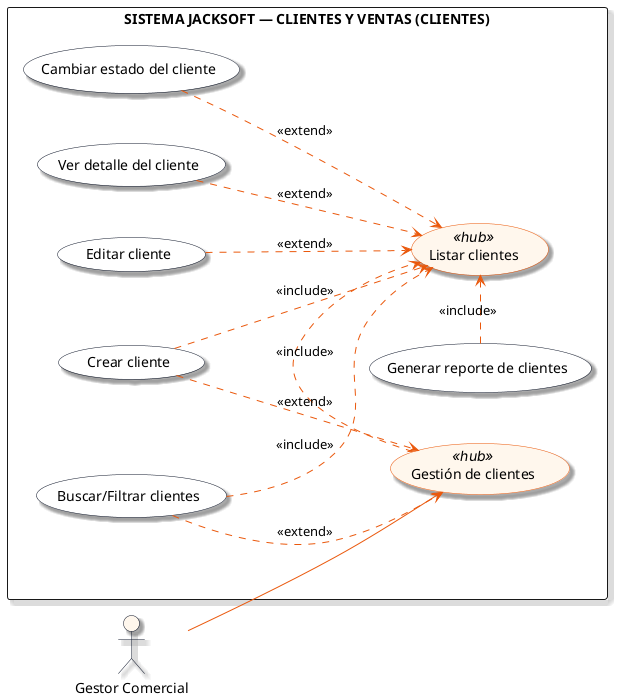
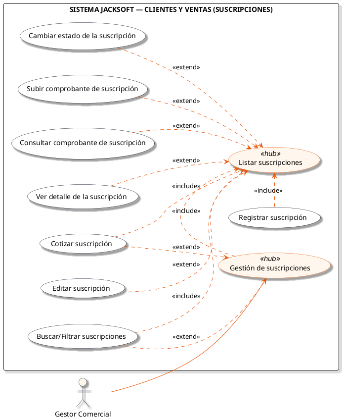

# Macro-Proceso: Clientes y Ventas

Gestión de clientes, cotización, registro y administración de suscripciones corporativas e individuales.

## Subprocesos Integrados

### Subproceso: CLIENTES
- **Total de Casos de Uso / Acciones:** 7
- **Actor Principal:** Gestor Comercial
- **Nodo Principal:** Gestión de clientes

#### Listado de Casos de Uso
1. Crear cliente
2. Listar clientes
3. Generar reporte de clientes
4. Ver detalle del cliente
5. Editar cliente
6. Cambiar estado del cliente
7. Buscar/Filtrar clientes

#### Diagrama PlantUML

---

### Subproceso: SUSCRIPCIONES
- **Total de Casos de Uso / Acciones:** 9
- **Actor Principal:** Gestor Comercial
- **Nodo Principal:** Gestión de suscripciones

#### Listado de Casos de Uso
1. Cotizar suscripción
2. Registrar suscripción
3. Listar suscripciones
4. Ver detalle de la suscripción
5. Editar suscripción
6. Cambiar estado de la suscripción
7. Subir comprobante de suscripción
8. Consultar comprobante de suscripción
9. Buscar/Filtrar suscripciones

#### Diagrama PlantUML

---
