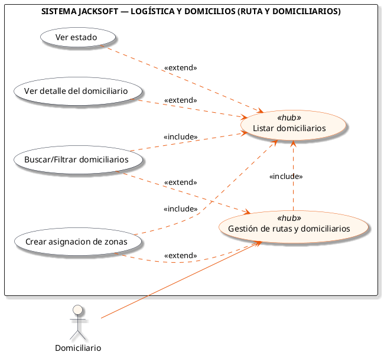
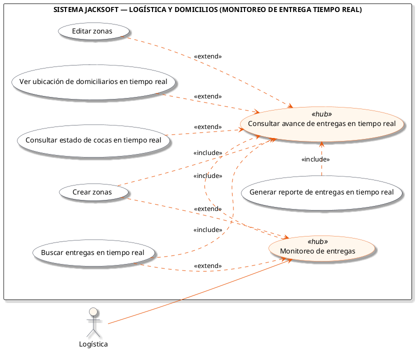
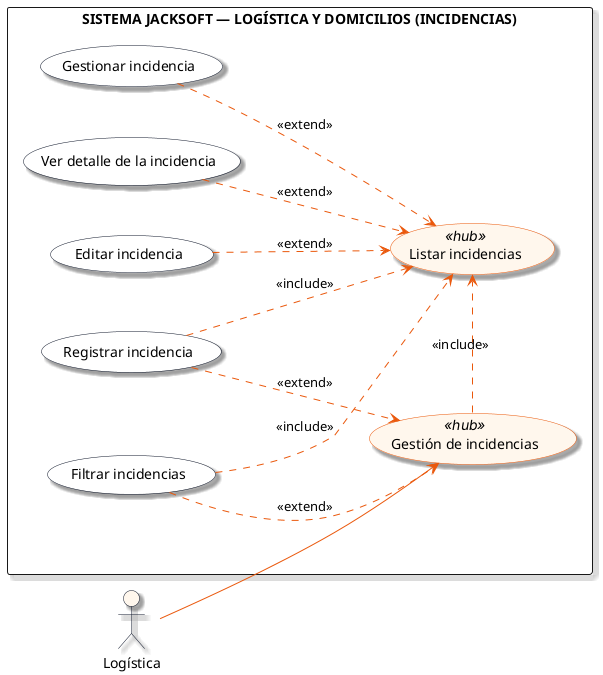

# Macro-Proceso: Logística y Domicilios

Asignación de zonas de reparto, gestión de domiciliarios, monitoreo en tiempo real de entregas y gestión de incidencias operativas.

## Subprocesos Integrados

### Subproceso: RUTA Y DOMICILIARIOS
- **Total de Casos de Uso / Acciones:** 5
- **Actor Principal:** Domiciliario
- **Nodo Principal:** Gestión de rutas y domiciliarios

#### Listado de Casos de Uso
1. Crear asignacion de zonas
2. Listar domiciliarios
3. Ver detalle del domiciliario
4. Ver estado
5. Buscar/Filtrar domiciliarios

#### Diagrama PlantUML

---

### Subproceso: MONITOREO DE ENTREGA "TIEMPO REAL"
- **Total de Casos de Uso / Acciones:** 7
- **Actor Principal:** Logística
- **Nodo Principal:** Monitoreo de entregas

#### Listado de Casos de Uso
1. Ver ubicación de domiciliarios en tiempo real
2. Consultar avance de entregas en tiempo real
3. Consultar estado de cocas en tiempo real
4. Buscar entregas en tiempo real
5. Generar reporte de entregas en tiempo real
6. Crear zonas
7. Editar zonas

#### Diagrama PlantUML

---

### Subproceso: INCIDENCIAS
- **Total de Casos de Uso / Acciones:** 6
- **Actor Principal:** Logística
- **Nodo Principal:** Gestión de incidencias

#### Listado de Casos de Uso
1. Registrar incidencia
2. Listar incidencias
3. Ver detalle de la incidencia
4. Editar incidencia
5. Gestionar incidencia
6. Filtrar incidencias

#### Diagrama PlantUML

---
