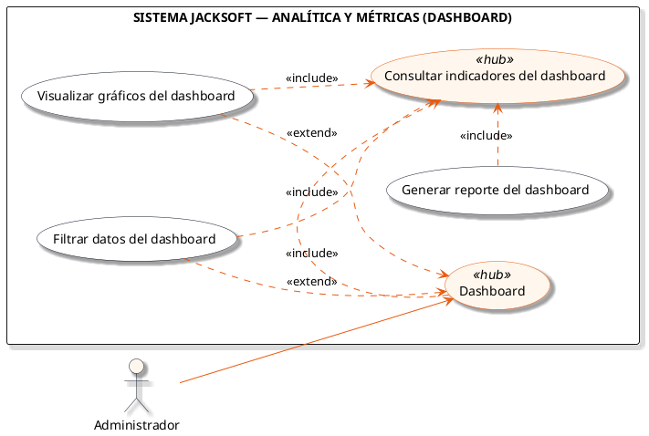

# Macro-Proceso: Analítica y Métricas

Consulta de indicadores clave de rendimiento (KPIs), visualización gráfica de métricas y generación de reportes de gestión.

## Subprocesos Integrados

### Subproceso: DASHBOARD
- **Total de Casos de Uso / Acciones:** 4
- **Actor Principal:** Administrador
- **Nodo Principal:** Dashboard

#### Listado de Casos de Uso
1. Consultar indicadores del dashboard
2. Visualizar gráficos del dashboard
3. Filtrar datos del dashboard
4. Generar reporte del dashboard

#### Diagrama PlantUML

---
